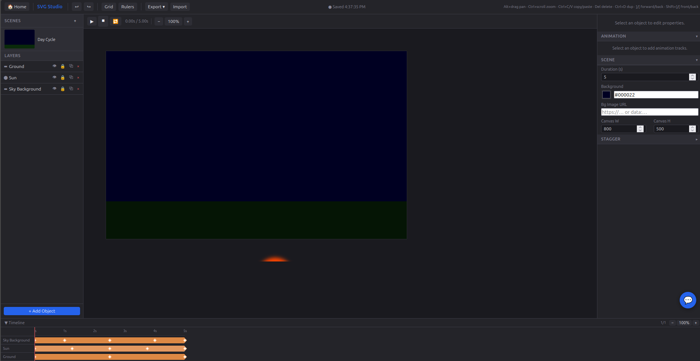
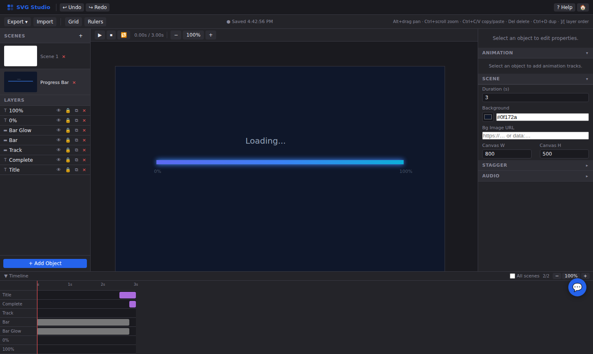
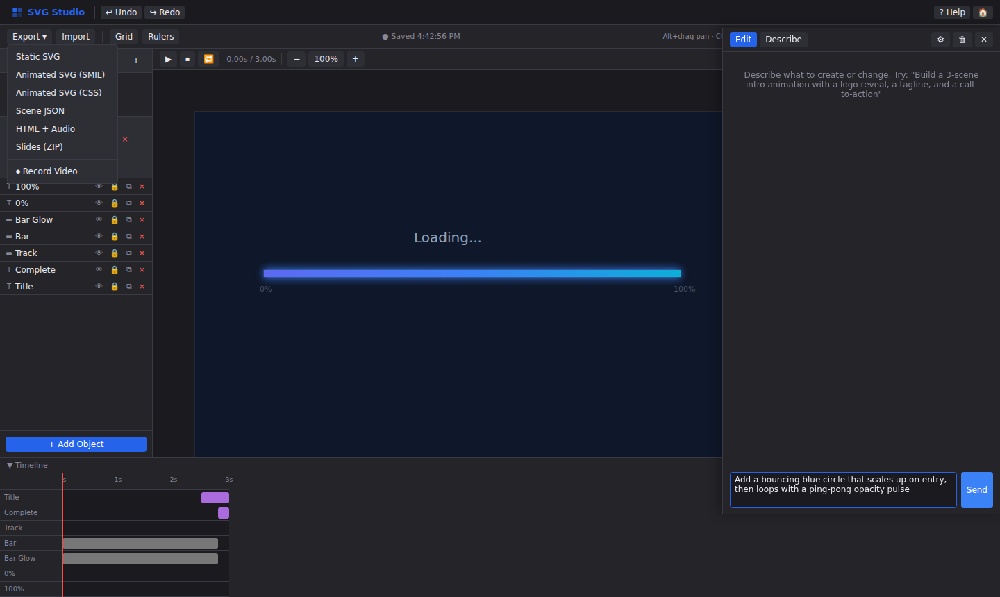
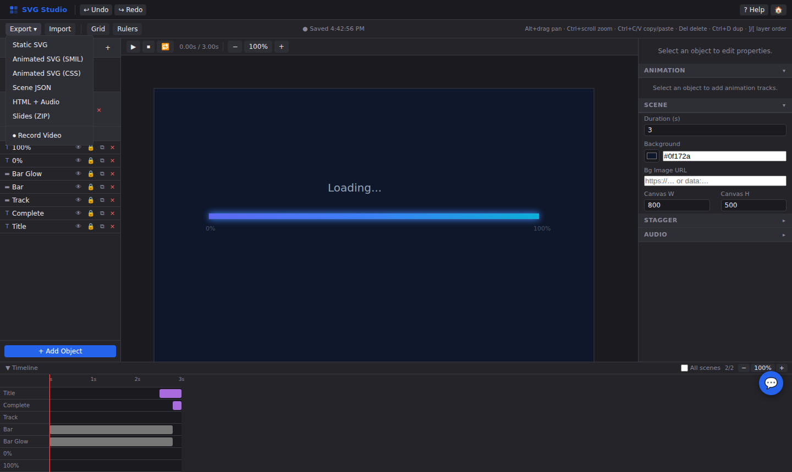

# SVG Animation Studio

**Design, animate, and ship vector motion — entirely in your browser.**

No installs. No accounts. No runtime dependencies.

---

## What you can build

A fintech dashboard where numbers count up and charts draw themselves. A logo that breathes. A loading screen that doesn't feel like waiting. An onboarding flow that teaches without words. An icon pack where every element has its own personality.

SVG Animation Studio is built for the moments when a static design isn't enough — when you need motion that's **lightweight enough to ship on the web**, precise enough to feel professional, and fast enough to iterate in real time.

---

## Why SVG animation?

Most web animation tools produce one of three things: a heavy JavaScript bundle, a video file, or a GIF. SVG animation produces none of those.

| | SVG (SMIL/CSS) | GIF | MP4 | JS animation lib |
|---|:---:|:---:|:---:|:---:|
| Typical file size | **< 10 KB** | 500 KB+ | 1 MB+ | 50–200 KB runtime |
| Scales to any resolution | ✓ | ✗ | ✗ | ✓ |
| Zero JavaScript runtime | ✓ | ✓ | ✓ | ✗ |
| CSS-styleable | ✓ | ✗ | ✗ | ✓ |
| Accessible / indexable | ✓ | partial | ✗ | ✓ |
| Embeds in `` | ✓ | ✓ | ✗ | ✗ |

The web has had native animation primitives for years. Most tools just haven't made them approachable. This one does.

---

## Key capabilities

### Multi-scene projects
Each scene is an independent canvas with its own objects, duration, and audio track. String scenes together for sequential playback or manage them as standalone assets.

### Full animation control
Per-object tracks for position (X, Y, or along a Bezier motion path), rotation, scale, opacity, and fill color.

- **6 easing modes** — linear, ease-in/out, bounce, spring
- **Loop behaviours** — none, loop, ping-pong, with delay per track
- **Keyframe editor** — multi-step timing within any track
- **Stagger system** — apply a preset to every object with a per-object offset in one click

### AI-assisted motion (optional)
Open the AI chat panel, describe what you want at any level of detail. Claude generates a precise patch, previews it live, and every change is undoable.

> "Create a three-scene fintech onboarding animation. Scene 1: a headline slides in. Scene 2: three feature icons appear in sequence. Scene 3: a CTA button pulses. Total duration 12 seconds. Blue and white palette."

The built-in AI is rate-limited. Remove limits by pointing to [your own proxy server](docs/custom-ai-provider.md) or providing a direct API key (OpenAI, Anthropic, Mistral, Ollama, and any OpenAI-compatible endpoint).

### Audio synchronisation
Attach audio tracks per scene. Local files stored in IndexedDB — never uploaded anywhere. Precise start time, offset trimming, duration, volume, mute, and loop controls. Audio is baked into the HTML export.

### Five export formats

| Format | Best for | Zero dependencies | Audio |
|---|---|:---:|:---:|
| **Static SVG** | Icons, illustrations, open-graph images | ✓ | — |
| **Animated SVG (SMIL)** | Self-playing web assets; embeds in `` | ✓ | — |
| **Animated SVG (CSS)** | Maximum browser compat; editable via CSS | ✓ | — |
| **Scene JSON** | Saving, sharing, version control, re-importing | ✓ | refs |
| **HTML + Audio** | Full presentations, demos, standalone playable pages | ✓ | ✓ |
| **PNG slide deck** | One PNG per scene, zipped | ✓ | — |
| **Video (WebM)** | Screen capture download | ✓ | — |

Exported HTML files are fully self-contained — no CDN, no fonts, no external requests. Drop the file anywhere and it plays.

---

## Community resources (this repository)

This repository is the community hub for SVG Animation Studio — example scenes, guides, templates, and more.

### Repository structure

| Folder | Contents |
|---|---|
| [`resources/docs/`](resources/docs/) | Guides, workflow tutorials, reference material |
| [`resources/examples/`](resources/examples/) | Curated example scenes (JSON) — load any into the editor in one click |
| [`.github/`](.github/) | PR and issue templates for contributing |

### Current example scenes

| Name | Tags | What it demonstrates |
|---|---|---|
| [Bouncing Ball](resources/examples/bouncing-ball.json) | motion, beginner, loop | Keyframe animation with squash & stretch |
| [Logo Reveal](resources/examples/logo-reveal.json) | reveal, text, beginner | Staggered two-element entrance |
| [Color Pulse](resources/examples/color-pulse.json) | color, loop, beginner | Ping-pong fill color loop |
| [Motion Path](resources/examples/motion-path.json) | motion, path, intermediate | 2D Bezier motion path track |
| [Progress Bar](resources/examples/progress-bar.json) | ui, gradient, intermediate | Width animation from 0→full with gradient fill |
| [Staggered Text Reveal](resources/examples/staggered-text-reveal.json) | text, reveal, intermediate | Multi-object entrance with stagger delay |
| [Loading Spinner](resources/examples/loading-spinner.json) | ui, loop, beginner | Three-dot scaleY ping-pong with offsets |
| [Gradient Sunrise](resources/examples/gradient-sunrise.json) | gradient, motion, intermediate | Radial gradient + y-position animation |

Want to share your own creations? See [CONTRIBUTING.md](CONTRIBUTING.md).

### How to load an example

1. Open [SVG Animation Studio](https://svg-animation-studio.netlify.app)
2. Click **Help → Examples** in the navigation header
3. Choose any example to load it as a new scene
4. Press **Space** to play — then select any object to inspect its tracks

---

## Guides

| Guide | What it covers |
|---|---|
| [Custom AI provider setup](docs/custom-ai-provider.md) | Deploy your own Cloudflare Worker proxy, or use a direct BYOK API key |

---

## AI prompts that work well

**Full scene from a brief:**
> "Create a three-scene fintech onboarding animation. Scene 1: a headline slides in. Scene 2: three feature icons appear in sequence. Scene 3: a call-to-action button pulses. Total 12 seconds. Blue and white palette."

**Physical motion:**
> "The card should fly in from the bottom-right corner, overshoot slightly, and settle. Make it feel like it has weight."

**Staggered reveal:**
> "Fade in all objects from opacity 0, each starting 0.1 seconds after the previous one. Complete in 1 second total."

**Surgical edits:**
> "The logo rotation track — change the easing from linear to spring and slow it down by 30%."

---

## Keyboard shortcuts

| Key | Action |
|---|---|
| `Space` | Play / Pause |
| `Ctrl + Z` | Undo |
| `Ctrl + Y` / `Ctrl + Shift + Z` | Redo |
| `Ctrl + D` | Duplicate selected object |
| `Ctrl + C` / `Ctrl + V` | Copy / Paste object |
| `Delete` / `Backspace` | Delete selected object |
| `]` / `[` | Move object forward / backward one layer |
| `Shift + ]` / `Shift + [` | Move object to front / back |
| `← ↑ → ↓` | Nudge 1 px |
| `Shift + ← ↑ → ↓` | Nudge 10 px |
| `Ctrl + scroll` | Zoom canvas (15 %–400 %) |
| `Alt + drag` | Pan canvas |
| `Escape` | Deselect |

---

## Technical stack

- **Core:** React 19 + Vite + TypeScript (strict mode)
- **State:** Zustand + Zundo (100-step undo/redo history)
- **Animation engine:** Custom RAF loop — no external animation libraries
- **Audio:** Web Audio API, assets in IndexedDB (never leave your browser)
- **AI proxy:** Cloudflare Worker — key never touches the browser in default mode

---

MIT License · Built by [@Mgregchi](https://github.com/Mgregchi)

